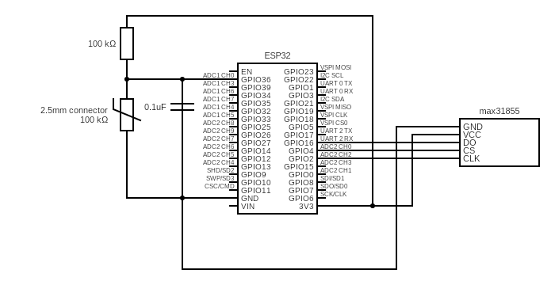

# Meat Fan
BBQ Fan Controller design [with ESPHome firmware](meat-fan.yaml)

The Meat Fan is currently on hold, first I'll focus on creating just a BBQ Thermometer, see below.

# Meat Temp
BBQ Thermometer design [with ESPHome firmware](meat-temp.yaml)

## Hardware
- ESP32 Development board
- PCB board (5 x 7cm or bigger)
- 15 pin female header (2 times). Optional, but allows for easy replacing and detaching the ESP.
- Thermocouple (k-type) hardware 
    - MAX31855 thermocouple board
    - Thermocouple (k-type)
- Meat probe (thermistor) hardware
    - Meat probe (100k Ohm at 25°C)
    - Resistor (100k Ohm)
    - 0.1uF capacitor (for reducing noise on the ADC pin)

## Circuit
[Circuit Diagram Edititor](https://www.circuit-diagram.org/editor/c/9313d815a8be4280a69bf171004afa7a)

